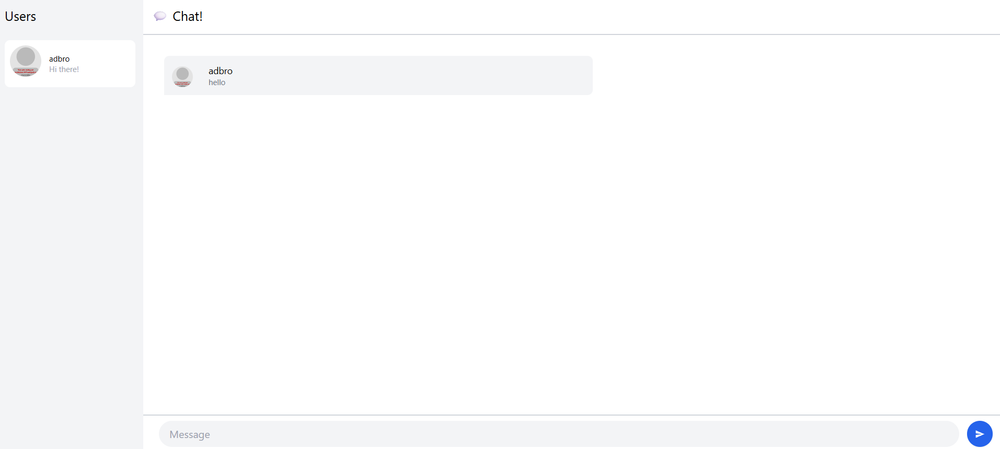
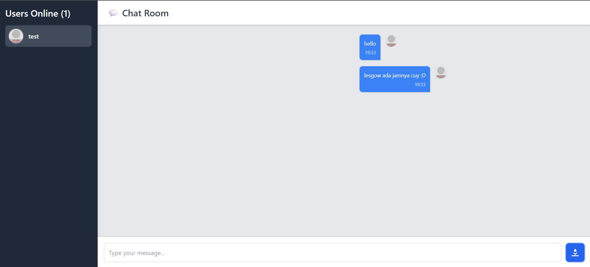

## Tutorial 3: WebChat using Yew

Tutorial ini bertujuan untuk membangun aplikasi webchat menggunakan Yew sebagai frontend dan awalnya menggunakan server WebSocket berbasis JavaScript (Node.js) seperti yang direferensikan dari blog post [Let's Build a WebSockets Project with Rust and Yew](https://blog.devgenius.io/lets-build-a-websockets-project-with-rust-and-yew-0-19-60720367399f).

### 3.1. Original code

Proyek server WebSocket JavaScript (`SimpleWebsocketServer`) dan klien Yew (`webchat_yew`) di-clone dan dijalankan sesuai panduan.

**Cara Menjalankan:**
1.  **Server (JavaScript - `SimpleWebsocketServer`):**
    *   Masuk ke direktori `gatau/SimpleWebsocketServer`.
    *   Jalankan `npm install` untuk menginstal dependensi.
    *   Jalankan `npm start` (atau `node src/app.js` jika script start tidak ada/berbeda) untuk memulai server WebSocket. Server ini biasanya berjalan di port seperti `8000`, `9000`, atau `8080` (sesuai konfigurasi server JS tersebut).
2.  **Klien (Yew - `webchat_yew`):**
    *   Masuk ke direktori `gatau/webchat_yew`.
    *   Jalankan `npm install` untuk menginstal dependensi build (seperti webpack).
    *   Jalankan `npm start` untuk mengkompilasi kode Rust ke WebAssembly dan menjalankan development server untuk klien Yew. Ini biasanya akan membuka browser ke `http://localhost:8080` (atau port lain yang dikonfigurasi webpack).
    *   Pastikan alamat WebSocket URL di `webchat_yew/src/services/websocket.rs` (misalnya `ws://127.0.0.1:PORT_SERVER_JS`) sesuai dengan port tempat server JS berjalan.

**Hasil Eksekusi dan Interaksi:**
Aplikasi berhasil berjalan dengan baik. Saya bisa memasukkan username di halaman login, kemudian diarahkan ke halaman chat. Pesan yang dikirim muncul di area chat, dan jika membuka beberapa tab browser atau klien, pesan akan tersinkronisasi antar klien melalui server WebSocket JavaScript.

### 3.2. Add some creativities to the webclient

Beberapa modifikasi kreatif dan perbaikan fungsionalitas telah diterapkan pada webclient Yew untuk meningkatkan tampilan, pengalaman pengguna, dan kejelasan informasi.

**Perubahan yang Dilakukan:**
1.  **Perbaikan Tampilan Pesan:** Pesan yang diterima dari server sekarang ditampilkan dengan benar sebagai teks, bukan lagi sebagai string JSON mentah. Ini dicapai dengan memastikan server JavaScript mengirimkan format pesan yang dapat di-parse dengan benar oleh klien Yew.
2.  **Timestamp pada Pesan:** Setiap pesan yang ditampilkan kini menyertakan timestamp (format Jam:Menit) kapan pesan tersebut diterima/diproses oleh klien.
3.  **Layout Pesan Berbeda untuk Pengguna Sendiri:** Pesan yang dikirim oleh pengguna sendiri kini memiliki styling yang berbeda (rata kanan, warna latar biru, avatar di kanan) untuk membedakannya dari pesan pengguna lain (rata kiri, warna latar putih, avatar di kiri).
4.  **Judul Halaman Browser Dinamis:** Judul tab browser diubah secara dinamis menggunakan `gloo_utils` untuk mencerminkan halaman yang sedang aktif (Login atau Chat).
5.  **Styling UI Ditingkatkan:**
    *   Sidebar pengguna online dipercantik dengan latar belakang lebih gelap, daftar pengguna yang lebih rapi, dan menampilkan jumlah pengguna online.
    *   Header ruang chat diberi judul yang lebih jelas.
    *   Area input pesan dan tombol kirim diberi styling yang lebih modern dan responsif.
    *   Warna latar belakang utama dan area pesan disesuaikan untuk kontras yang lebih baik.
6.  **Kirim Pesan dengan Tombol Enter:** Pengguna sekarang dapat mengirim pesan dengan menekan tombol "Enter" pada kolom input, selain mengklik tombol kirim.
7.  **Avatar Pengguna Konsisten:** Avatar pengguna (dari DiceBear) dibuat konsisten dengan menggunakan nama pengguna sebagai *seed* untuk URL avatar.

**Penjelasan Tambahan:**
Perbaikan utama adalah pada cara pesan diproses dan ditampilkan, sehingga kini konten pesan aktual yang muncul, bukan struktur data mentahnya. Penambahan timestamp dan layout pesan yang berbeda meningkatkan keterbacaan alur percakapan. Peningkatan styling bertujuan untuk membuat antarmuka lebih modern, intuitif, dan menyenangkan secara visual. Fitur kirim dengan Enter adalah peningkatan UX standar.

**Contoh Screenshot UI yang Sudah Diperbaiki:**

